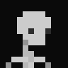

<div id="header">
    <p align="center">
      <br>
      <b>astera</b><br>
	  <span font-size="16px">a cross platform game library</span><br>
      <span font-size="12px">Made by <a href="http://tek256.com">Devon</a> with love.</span><br><br>
      <span><a href="https://github.com/tek256/astera/wiki/Setup">Setup</a> | <a href="https://github.com/tek256/astera/tree/master/docs/examples/">Examples</a> | <a href="https://discordapp.com/invite/63GvpMh">Discord</a> | <a href="https://github.com/sponsors/tek256">Support</a></span><br><br>
      <span></span>
    </p>
</div>

### About
Astera is a game library focused on performance, portability, and maintainability. Astera aims to rely on as few dependencies as possible.  

#### Latest Release: 0.01-PRE

### Building
Astera and it's dependencies are built using CMake. You can run your own CMake command or try using one of the automated build scripts.
```
Usage build_unix.sh && build_win.bat [-hrcxqq]
-h  Show this info
-r  Build release (optimizations, -O2)
-c  Build clean (remove previous build generated by this script)
-x  Don't build examples
-q  Quiet output
-qq Silence all output
Windows Only:
-m  Force use MinGW (gcc/g++)
-l  Force use LLVM (clang/clang++)
```

Example script usage:
```
./build_unix.sh -r // Generate release candidate
```

Example CMake usage:
```
cmake -Bbuilld -S. -DASTERA_BUILD_EXAMPLES=OFF -DCMAKE_BUILD_TYPE=Release
```

For more information see the relevant [wiki page](https://github.com/tek256/astera/wiki/Building) or the `docs/building.md` file.

### Libraries Used
[GLFW](https://github.com/glfw/glfw), [OpenAL-Soft](https://github.com/kcat/openal-soft), [GLAD](https://github.com/Dav1dde/glad), [STB](https://github.com/nothings/stb/) Image & Vorbis, [nanovg](https://github.com/memononen/nanovg), and [ZIP](https://github.com/kuba--/zip).

### Target Platforms
Here are the target platforms for this library:  
```
- Windows
- Linux
- Mac OSX (versions supporting OpenGL 3.3+)
- BSD
```  

### Changelog
```
May X, 2020
- 0.01 Release!
- Partial collision detection (AABB & Circle)
- Moved to CMake for build system (special thanks to @slurps-mad-rips)
- Remove level.c/h, conf.c/h, game.c/h, and main.c
- Library style build now (use examples to see astera running)
- Examples exist & run now!
- Culled out some somewhat useless tools, will make more as needed.
- Overall library tweaks & modifications to make it more functional.
- Refactoring to prevent namespace collisions!

Mar 21, 2020
- Updated OpenAL-Soft to 1.20.1
- AABB & Circle Collision detection working
- Audio Effects completed
- Audio Distance Calculations done
- In progress: Quad trees & level system

For older changes see docs/changelog-archive.txt
```

### Special Thanks
[Isabella Muerte](https://github.com/slurps-mad-rips) for being a patient friend and helping create the build system.  
[Sharlock93](https://github.com/sharlock93) for helping diagnose issues.  
[Dan Bechard](https://github.com/dbechrd) for helping test on Windows & discuss ideas with.  

### License  
The Unlicense 
```
This is free and unencumbered software released into the public domain.

Anyone is free to copy, modify, publish, use, compile, sell, or
distribute this software, either in source code form or as a compiled
binary, for any purpose, commercial or non-commercial, and by any
means.

In jurisdictions that recognize copyright laws, the author or authors
of this software dedicate any and all copyright interest in the
software to the public domain. We make this dedication for the benefit
of the public at large and to the detriment of our heirs and
successors. We intend this dedication to be an overt act of
relinquishment in perpetuity of all present and future rights to this
software under copyright law.

THE SOFTWARE IS PROVIDED "AS IS", WITHOUT WARRANTY OF ANY KIND,
EXPRESS OR IMPLIED, INCLUDING BUT NOT LIMITED TO THE WARRANTIES OF
MERCHANTABILITY, FITNESS FOR A PARTICULAR PURPOSE AND NONINFRINGEMENT.
IN NO EVENT SHALL THE AUTHORS BE LIABLE FOR ANY CLAIM, DAMAGES OR
OTHER LIABILITY, WHETHER IN AN ACTION OF CONTRACT, TORT OR OTHERWISE,
ARISING FROM, OUT OF OR IN CONNECTION WITH THE SOFTWARE OR THE USE OR
OTHER DEALINGS IN THE SOFTWARE.

For more information, please refer to <http://unlicense.org>
```

